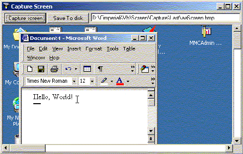



## Capture Screen and Mouse \*\*\*\*RELOADED

### Description

Capture screen and mouse, show it in a picturebox and let you save it on disk (bmp format)
 
### More Info
 
Use Api

ie:GetCursorPos, GetCursor,GetCursorInfo, DrawIcon, and keybd_event - this last for win2k or earlier os, while for win9x and Nt used routines from MSDN to grab screen

Modified to grab aslo the mouse shape...It should work with win98, not with win95. I tested on win2K and it worked fine (but did not try with custom or animated cursors...).

             |
---                |---
**Submitted On**   |2003-12-04 21:54:08
**By**             |[Cesare Imperiali](https://github.com/Planet-Source-Code/PSCIndex/blob/master/ByAuthor/cesare-imperiali.md)
**Level**          |Intermediate
**User Rating**    |4.7 (14 globes from 3 users)
**Compatibility**  |VB 5\.0, VB 6\.0
**Category**       |[Graphics](https://github.com/Planet-Source-Code/PSCIndex/blob/master/ByCategory/graphics__1-46.md)
**World**          |[Visual Basic](https://github.com/Planet-Source-Code/PSCIndex/blob/master/ByWorld/visual-basic.md)
**Archive File**   |[Capture\_Sc1680671252003\.zip](https://github.com/Planet-Source-Code/cesare-imperiali-capture-screen-and-mouse-reloaded__1-50310/archive/master.zip)

### API Declarations

Reloaded to add the GetCursorInfo Api to grab mouse shape

